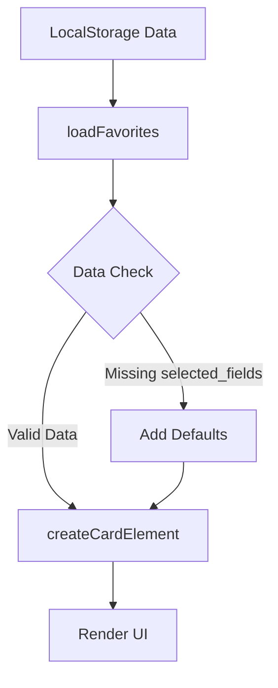
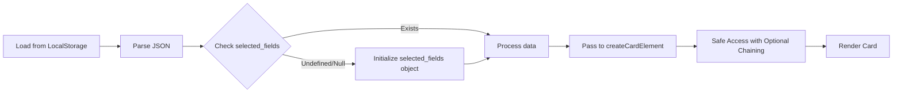

## Product Overview

修复现有Web应用中的收藏夹数据兼容性bug。问题的根源是旧版本收藏数据缺少`selected_fields`属性，导致代码访问`item.selected_fields.deliverable_type?.selected_value`时抛出"无法读取 undefined 的 'deliverable_type' 属性"错误。

## Core Features

- 在读取收藏数据时添加空值检查
- 为旧数据提供默认值填充逻辑
- 确保UI渲染不会因数据结构不完整而崩溃
- 保持向前兼容性

## Tech Stack

- 运行环境: 浏览器原生JavaScript (HTML/CSS/JS)
- 数据存储: LocalStorage
- 修复位置: `script.js` 中的 `loadFavorites()` 和 `createCardElement()` 函数

## Architecture Design

### System Architecture



### Data Flow



## Implementation Details

### Code Structure

```javascript
// Fix in loadFavorites()
function loadFavorites() {
    // ... existing code ...
    favorites.forEach(item => {
        // Add compatibility layer
        if (!item.selected_fields) {
            item.selected_fields = {
                deliverable_type: { selected_value: 'default' },
                // add other necessary fields
            };
        }
        createCardElement(item);
    });
}

// Fix in createCardElement()
function createCardElement(item) {
    // Use optional chaining and nullish coalescing
    const type = item.selected_fields?.deliverable_type?.selected_value ?? 'unknown';
    // ... rest of code ...
}
```

### Technical Implementation Plan

1. **问题定位**: 在`script.js:1011`处添加防御性代码
2. **数据迁移**: 在`loadFavorites`中遍历数据，为缺失属性的对象添加默认值
3. **安全访问**: 使用可选链操作符(`?.`)和空值合并(`??`)重构属性访问
4. **数据回写**: 修复后的数据可选择性地回写至LocalStorage以完成数据迁移

### Integration Points

- **LocalStorage**: 直接读取和修改
- **DOM渲染**: 确保`createCardElement`接收规范化后的数据

## Agent Extensions

### SubAgent

- **code-explorer** (from <subagent>)
- Purpose: 在`script.js`中定位`loadFavorites`和`createCardElement`函数，分析当前数据结构
- Expected outcome: 准确定位错误代码行和相关上下文，为修复提供精确位置