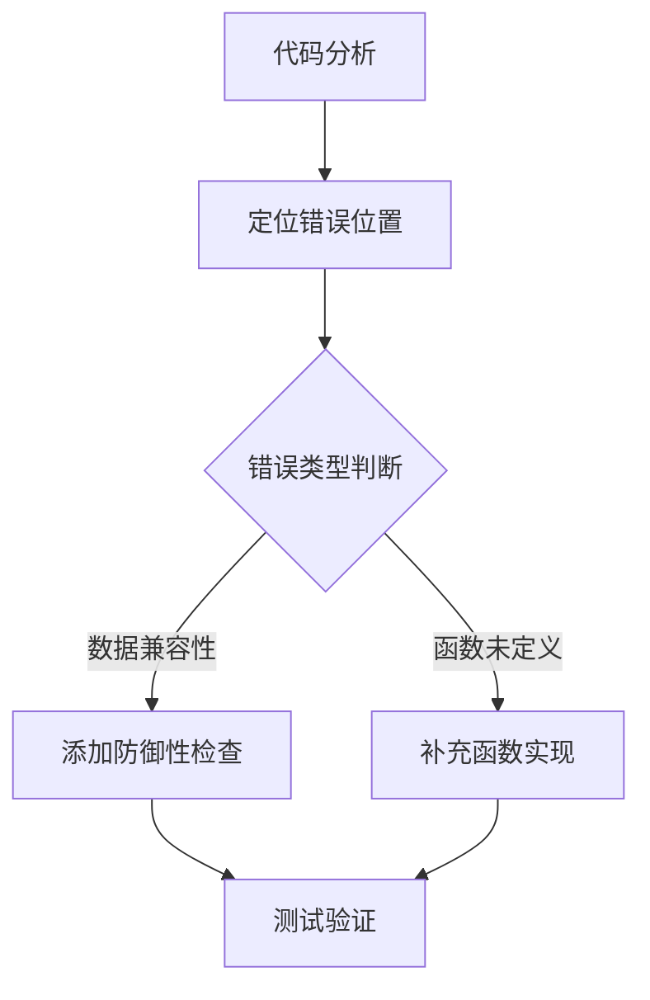

## Product Overview

修复JavaScript项目中的两个运行时错误，确保收藏夹功能正常加载且语言切换功能稳定运行。

## Core Features

- 修复收藏夹加载时的数据兼容性错误
- 修复未定义函数引用错误

## Tech Stack

- **项目类型**: 纯前端JavaScript项目
- **修复范围**: script.js 文件中的错误处理
- **调试技术**: 浏览器开发者工具控制台

## Architecture Design

### 问题定位与修复流程



### Implementation Details

#### 错误1修复: 收藏夹数据兼容性

**问题**: script.js:1011 `selected_fields` 为 undefined
**解决方案**: 在 `createCardElement` 函数中添加防御性检查

```javascript
// 修复代码示例
const deliverableType = card.selected_fields 
  ? card.selected_fields.deliverable_type 
  : 'default_value'; // 或跳过该属性
```

#### 错误2修复: 未定义函数引用

**问题**: script.js:390 `resetWorldDimensionControls` 函数未定义
**解决方案**: 实现 `resetWorldDimensionControls` 函数

```javascript
// 函数实现框架
function resetWorldDimensionControls() {
  // 重置世界维度控件状态的逻辑
  // 例如：重置表单值、恢复默认设置等
}
```

### 修复步骤

1. 读取 script.js 文件，定位第1011行和第390行
2. 分析 `loadFavorites()` 和 `createCardElement()` 的调用链
3. 为 `selected_fields` 添加空值检查
4. 实现 `resetWorldDimensionControls` 函数
5. 验证修复效果，确保无副作用

## Agent Extensions

### SubAgent

- **code-explorer**
- Purpose: 搜索和分析 script.js 文件，定位错误代码上下文
- Expected outcome: 精确定位到第1011行和第390行及其相关函数的完整代码结构