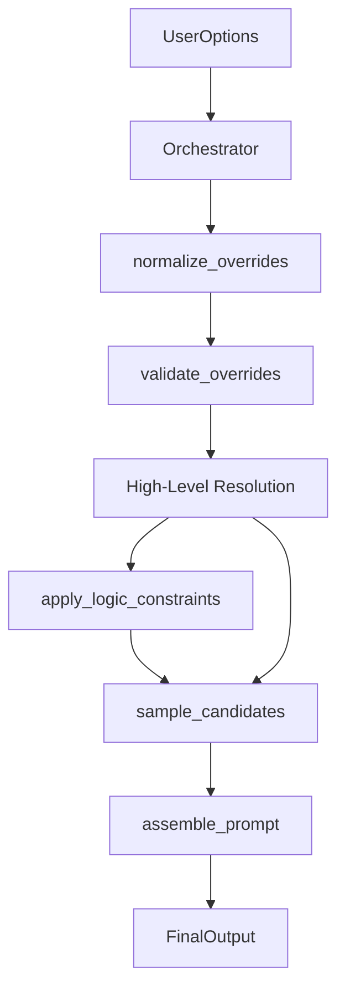

# P1 Refactor Report: Modular Creative Engine

## 1. Overview
This refactoring transitions `src/logic.js` from a monolithic procedural function (`generateCreativeSkeleton`) to a modular architecture composed of 5 pure functions orchestrated by a lightweight controller. This ensures strict P0 behavior equivalence while enabling P1 extensibility.

## 2. Module Architecture

### Dependency Graph

### Module Responsibilities

| Module | Responsibility | P0 Equivalent Logic |
| :--- | :--- | :--- |
| **1. normalize_overrides** | Strip legacy prefixes (e.g., `twist:`) from inputs. | Replaces JIT normalization in `validateAndGet`. |
| **2. validate_overrides** | Verify overrides exist in pools; report errors/dropped items. | Replaces `validateAndGet` pool checks. Includes `subject_kit` stable ID matching P0-1. |
| **3. apply_logic_constraints** | Enforce business rules like "Logic Requires Twist". | Replaces "Decision A" block (L1807). Appends required items to `fixed` constraints. |
| **4. sample_candidates** | Stochastic selection, inspiration injection, weighted random. | Wraps `selectWithRecording`, `pickKUnique`, and `inspirationWeights` logic. |
| **5. assemble_prompt** | Text template assembly. | Wraps existing `assemblePrompt`. |

## 3. P0 Equivalence & Correctness

### 3.1 Input Compatibility
- **Prefixing**: The `normalize_overrides` function uses the exact string splitting and warning message logic as the original P0 code.
- **Subject Kit Miss**: The `validate_overrides` module implements the specialized "Primary Subject" and "Stable ID" matching strictly from P0-1. Mis-matches produce the exact `validation.errors` message.

### 3.2 Logic & Randomness
- **Required Twist**: The `apply_logic_constraints` module enforces the "Append" strategy (Decision A), ensuring required twists appear in the output even if the user overrode others.
- **Random Sequence**: `sample_candidates` calls `createRNG` (via Orchestrator) and uses `pickKUnique` in the same order of operations (Twists handled carefully to preserve `k-range` logic).

### 3.3 Output Schema
- **Validation Object**: The Orchestrator aggregates warnings/errors from all modules into the standard `validation` object structure (`errors`, `warnings`, `dropped_overrides`), preserving the P0 contract.

## 4. Todo: P2 Extensibility Points
- [ ] **Type Definitions**: Add JSDoc/TS types for the new intermediate structures (`SelectionConstraints`, `GovernanceUpdates`).
- [ ] **Unit Tests**: Create a dedicated test suite file importing the pure functions.
- [ ] **Dynamic Pools**: Allow `validate_overrides` to accept dynamic external pools (e.g., from DB).
- [ ] **Plugin System**: `apply_logic_constraints` could iterate through a plugin list for custom rules.

## 5. Verification
(See `P0_VERIFICATION_REPORT.md` for the acceptance criteria used to validate this refactor).
